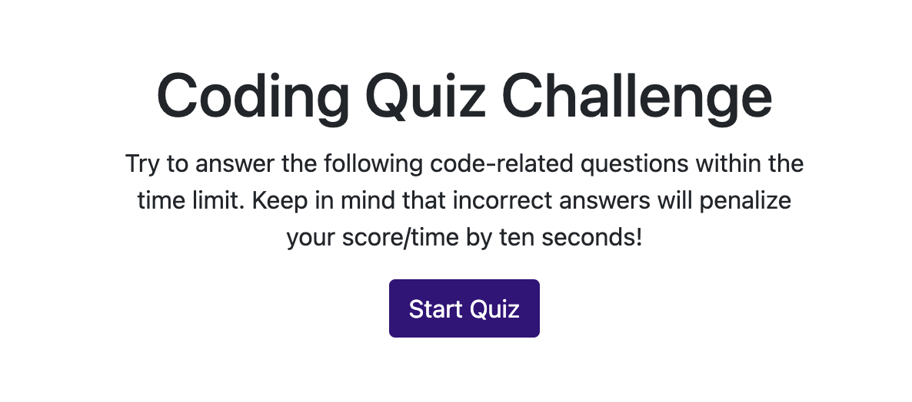

# Code Quiz

## Description
A code quiz that gives users 75 seconds to answer questions.
* Users can save high scores at the end of the quiz by entering initials.
* The "View High Scores" button shows a list of saved high scores.

## Deployed Link
https://mariacowdrey.github.io/code-quiz/

## Technologies Used
* Bootstrap
* jQuery
* Javascript
* HTML
* CSS
